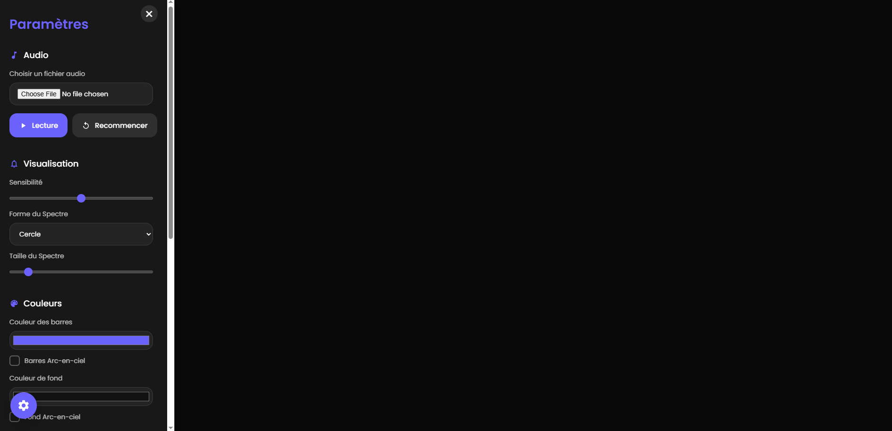

# Spectra - Visualiseur Audio Moderne

Un visualiseur audio élégant et personnalisable basé sur la Web Audio API et Canvas.



## 🎵 Caractéristiques

- Visualisation en temps réel du spectre audio
- Plusieurs formes de visualisation : cercle, ligne, étoile, spirale
- Personnalisation des couleurs avec effets arc-en-ciel
- Ajout d'une image d'arrière-plan personnalisée
- Texte personnalisable au centre
- Enregistrement de l'image du visualiseur
- Enregistrement en vidéo MP4 avec son
- Interface utilisateur moderne et intuitive
- Mode plein écran
- Sensibilité et échelle ajustables

## 🚀 Comment l'utiliser

1. Ouvrez le fichier `index.html` dans votre navigateur
2. Cliquez sur l'icône d'engrenage pour ouvrir le menu des paramètres
3. Chargez un fichier audio ou utilisez les contrôles de lecture/pause
4. Personnalisez la visualisation selon vos préférences
5. Enregistrez une image ou une vidéo si vous le souhaitez

## 💻 Technologies utilisées

- HTML5
- CSS3 (avec variables CSS pour le thème)
- JavaScript
- Web Audio API
- Canvas API
- MediaRecorder API (pour l'enregistrement vidéo)

## 🧩 Structure du projet

```
.
├── index.html      # Fichier HTML principal avec CSS intégré et JavaScript
├── screenshot.png  # Capture d'écran du visualiseur
└── README.md       # Ce fichier README
```

## 🎨 Personnalisation

Le visualiseur offre de nombreuses options de personnalisation :

- **Audio** : Chargez votre propre fichier audio, contrôlez la lecture/pause
- **Visualisation** : Ajustez la sensibilité, choisissez la forme et la taille du spectre
- **Couleurs** : Personnalisez les couleurs des barres et de l'arrière-plan, activez les effets arc-en-ciel
- **Personnalisation** : Ajoutez une image d'arrière-plan, du texte personnalisé avec couleur et taille ajustables
- **Actions** : Enregistrez une image du visualiseur ou une vidéo MP4 complète avec son

## 📋 Prérequis

- Un navigateur web moderne supportant :
  - Web Audio API
  - Canvas API
  - MediaRecorder API (pour l'enregistrement vidéo)

## 🔖 Tags

```
#audio-visualizer #music-visualization #web-audio-api #canvas #spectrum-analyzer 
#javascript #html5 #css3 #audio-processing #creative-coding #media-player 
#visualiseur-audio #traitement-audio #musique #interface-utilisateur
```

## 📝 Note

Ce visualiseur est conçu pour un usage personnel et éducatif. Pour un déploiement commercial, considérez les performances sur différents appareils et l'optimisation du code.

## 📜 Licence

MIT License

---

Créé avec ❤️ pour les amateurs de musique et de visualisations

# Spectra - Modern Audio Visualizer

An elegant and customizable audio visualizer based on the Web Audio API and Canvas.


## 🎵 Features

- Real-time audio spectrum visualization
- Multiple visualization shapes: circle, line, star, spiral
- Color customization with rainbow effects
- Custom background image support
- Customizable center text
- Screenshot capture functionality
- MP4 video recording with audio
- Modern and intuitive user interface
- Fullscreen mode
- Adjustable sensitivity and scale

## 🚀 How to Use

1. Open the `index.html` file in your browser
2. Click the gear icon to open the settings menu
3. Load an audio file or use the play/pause controls
4. Customize the visualization to your preferences
5. Save an image or video if desired

## 💻 Technologies Used

- HTML5
- CSS3 (with CSS variables for theming)
- JavaScript
- Web Audio API
- Canvas API
- MediaRecorder API (for video recording)

## 🧩 Project Structure

```
.
├── index.html      # Main HTML file with embedded CSS and JavaScript
├── screenshot.png  # Screenshot of the visualizer
└── README.md       # This README file
```

## 🎨 Customization

The visualizer offers numerous customization options:

- **Audio**: Load your own audio file, control playback
- **Visualization**: Adjust sensitivity, choose the shape and size of the spectrum
- **Colors**: Customize bar and background colors, enable rainbow effects
- **Personalization**: Add a background image, custom text with adjustable color and size
- **Actions**: Save a screenshot or a complete MP4 video with sound

## 📋 Requirements

- A modern web browser supporting:
  - Web Audio API
  - Canvas API
  - MediaRecorder API (for video recording)

## 🔖 Tags

```
#audio-visualizer #music-visualization #web-audio-api #canvas #spectrum-analyzer 
#javascript #html5 #css3 #audio-processing #creative-coding #media-player 
#sound-visualization #frequency-analysis #real-time-visualization #web-development
```

## 📝 Note

This visualizer is designed for personal and educational use. For commercial deployment, consider performance on different devices and code optimization.

## 📜 License

MIT License

---

Created with ❤️ for music and visualization enthusiasts