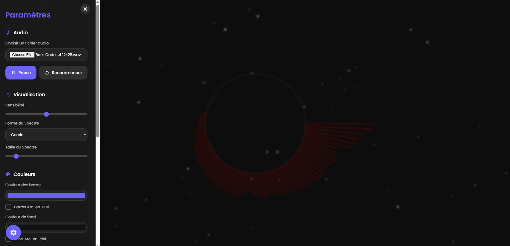

# Spectra - Modern Audio Visualizer

An elegant and customizable audio visualizer based on the Web Audio API and Canvas.



## 🎵 Features

- Real-time audio spectrum visualization
- Multiple visualization shapes: circle, line, star, spiral
- Color customization with rainbow effects
- Custom background image support
- Customizable center text
- Screenshot capture functionality
- MP4 video recording with audio
- Modern and intuitive user interface
- Fullscreen mode
- Adjustable sensitivity and scale

## 🚀 How to Use

1. Open the `index.html` file in your browser
2. Click the gear icon to open the settings menu
3. Load an audio file or use the play/pause controls
4. Customize the visualization to your preferences
5. Save an image or video if desired

## 💻 Technologies Used

- HTML5
- CSS3 (with CSS variables for theming)
- JavaScript
- Web Audio API
- Canvas API
- MediaRecorder API (for video recording)

## 🧩 Project Structure

```
.
├── index.html      # Main HTML file with embedded CSS and JavaScript
├── screenshot.png  # Screenshot of the visualizer
└── README.md       # This README file
```

## 🎨 Customization

The visualizer offers numerous customization options:

- **Audio**: Load your own audio file, control playback
- **Visualization**: Adjust sensitivity, choose the shape and size of the spectrum
- **Colors**: Customize bar and background colors, enable rainbow effects
- **Personalization**: Add a background image, custom text with adjustable color and size
- **Actions**: Save a screenshot or a complete MP4 video with sound

## 📋 Requirements

- A modern web browser supporting:
  - Web Audio API
  - Canvas API
  - MediaRecorder API (for video recording)

## 🔖 Tags

```
#audio-visualizer #music-visualization #web-audio-api #canvas #spectrum-analyzer 
#javascript #html5 #css3 #audio-processing #creative-coding #media-player 
#sound-visualization #frequency-analysis #real-time-visualization #web-development
```

## 📝 Note

This visualizer is designed for personal and educational use. For commercial deployment, consider performance on different devices and code optimization.

## 📜 License

MIT License

---

Created with ❤️ for music and visualization enthusiasts
